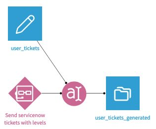

# ServiceNow Plugin

This Dataiku DSS plugin provides a read connector to interact with [ServiceNow](https://www.servicenow.com/) tables.

## Setup

### Create service accounts

As a DSS admin, go to *Applications > Plugins > Installed > ServiceNow > Settings > Service accounts > + Add preset*. Add the URL to the ServiceNow instance to reach. Add the user name and password of the ServiceNow account that will be used to interact with the instance. Finally, share the preset with the relevant groups.

### Create an instance preset for user accounts

As a DSS admin, go to *Applications > Plugins > Installed > ServiceNow > Settings > User accounts > + Add preset*. Add the URL to the ServiceNow instance to reach. Share the preset with everyone.
Once this preset is create, each DSS user that requires accessing to the ServiceNow instance will have to go to their own *profile page > Credentials > created preset > Edit symbol*, and add their own user name and password. 

## Read a ServiceNow table

In the flow, click on *+Dataset > Plugins/ServiceNow > ServiceNow* table to dataset. Select the appropriate authentication type and preset and the table to retrieve. Press `Test & get schema` and `Create`

## Use with a LLM agent

This plugin can be used as a tool by an agent to create ServiceNow issues. This requires Dataiku >= 12.6.2.

### Example Use Case: Create Issues Based on User Input

In this example, we aim to process a dataset of messages from user tickets and create ServiceNow issues if necessary.
- First, we need to create the agent tool. In the project's flow, click on **Analysis** > **Agent tools** > **+New agent tool** > **Create a ServiceNow issue**. Name the identifier and the agent.
- Then, we can create the actual agent. Click on **+Other** > **Generative AI** > **Visual Agent**, name the agent, click on v1, and add the tool (**+Add tool**) created in the previous step. In the agent's *Additional prompt* section, describe what are your specifications on what the parameters in the ticket should contain. The agent tool can fill in the following parameters: **description**, **summary**, **emergency** and **impact**. An example of specification could be *The impact should be set to 1 only if the problem impact production*
- Once this is done, the agent can be used in place of an LLM in your prompt and LLM settings. For instance, a simple LLM recipe with the prompt *You are an IT agent and your mission is to write ServiceNow ticket if the user's message requires it.*

## License

Copyright 2024 Dataiku SAS

This plugin is distributed under the Apache License version 2.0
